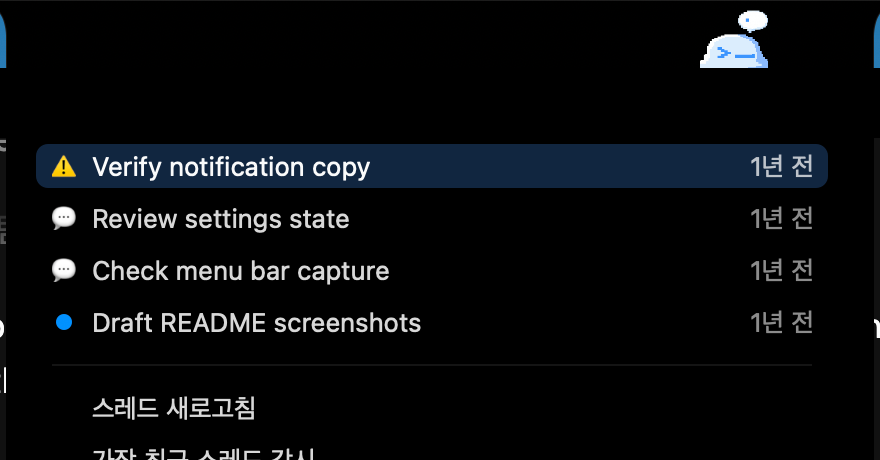
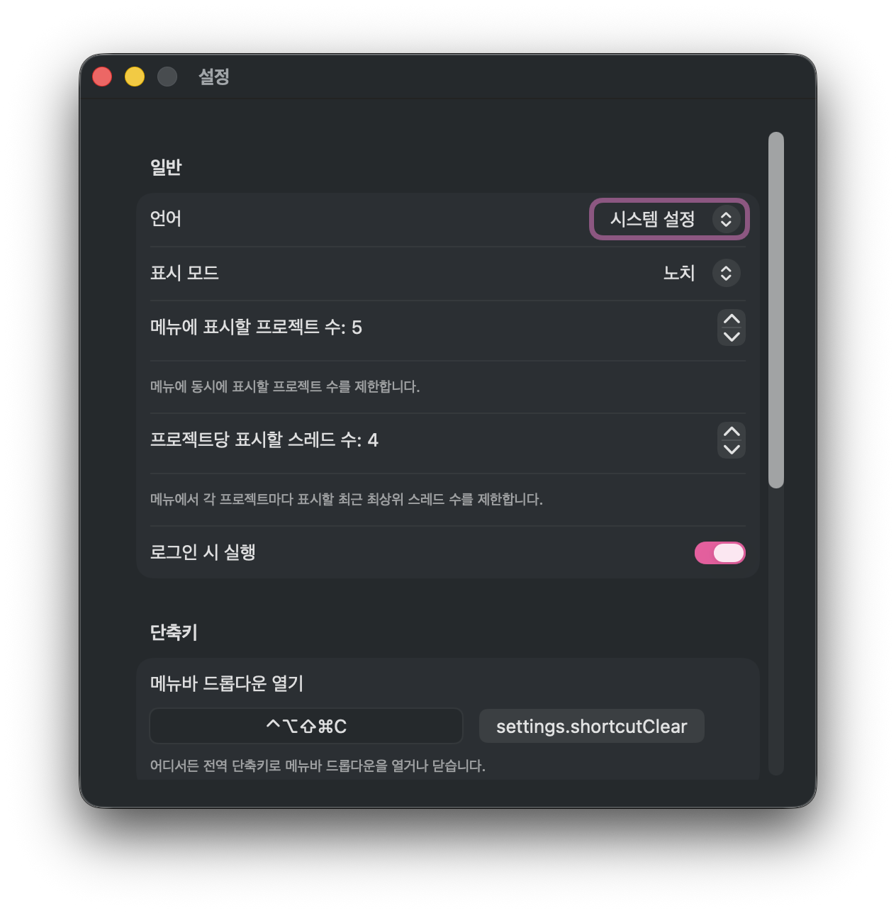

# CodexMate

> Codex keeps getting better, but human attention is still the bottleneck. CodexMate was built to reduce that bottleneck, so you can keep multiple projects moving without constantly checking, waiting, and context-switching.

CodexMate is a macOS menu bar companion for Codex Desktop. It helps you stay on top of recent threads, approvals, completions, and failures so your attention only returns when work actually needs you.

짧게 말하면, CodexMate는 AI가 아니라 인간의 주의력이 병목이 되는 순간을 줄이기 위한 Codex Desktop 메뉴바 동반 앱입니다.

## What CodexMate Does

CodexMate adds a lightweight layer on top of Codex Desktop. Instead of repeatedly checking windows and threads by hand, you can watch active work from the menu bar, catch important state changes, and jump back into the right thread when needed.

## See the Flow




1. Watch recent Codex threads from the menu bar.
2. Catch approvals, completions, and failures without babysitting every window.
3. Jump back into the right thread when attention is actually needed.

## Download and Get Started

- Download the latest release archive: [GitHub Releases](https://github.com/gityeop/CodexMate/releases/latest)
- Requires `macOS 13+`
- Designed for people who already use Codex Desktop

1. Download the latest release archive from GitHub Releases.
2. Unzip the archive to reveal `CodexMate.app`.
3. Open `CodexMate.app` and keep it in the menu bar.
4. Return to Codex Desktop and let CodexMate surface the moments that need your attention.

## Run

```bash
swift run CodexMate
```

If the `codex` binary is not in the default app bundle path or `PATH`, set:

```bash
CODEX_BINARY=/absolute/path/to/codex swift run CodexMate
```

If you are running inside UTM or another VM and the app seems to "not launch", force a normal app window on startup:

```bash
CODEXMATE_REGULAR_APP=1 \
CODEXMATE_OPEN_SETTINGS_ON_LAUNCH=1 \
CODEX_BINARY=/absolute/path/to/codex \
swift run CodexMate
```

This disables the accessory-only launch style for that run so the app appears in the Dock/app switcher and immediately opens Settings.

For the packaged `.app`, you can do the same with launch arguments:

```bash
open -a /absolute/path/to/CodexMate.app --args --regular-app --open-settings-on-launch
```

## UTM Troubleshooting

- The app only supports `macOS 13+`.
- Run it from a GUI login session inside the VM, not over SSH or another headless shell.
- If the menu bar item is hard to spot in the VM, use `CODEXMATE_REGULAR_APP=1` and `CODEXMATE_OPEN_SETTINGS_ON_LAUNCH=1`.
- The packaged `.app` now opens `Settings` automatically on first launch so you still get a visible window even if the menu bar item is not obvious.
- If CodexMate starts but cannot connect, point `CODEX_BINARY` at a working `codex` binary inside the guest.
- Startup debug logs are written to `~/Library/Logs/CodexMate/overlay-debug.log`.

## Notes

- The current app-server request method for user input is `item/tool/requestUserInput`.
- Live `turn/*` and approval events still only come from the app-server instance this menu bar app launches.
- The menu bar refreshes Desktop activity every 1 second and refreshes the thread list every 5 seconds.
- For other recent Codex Desktop threads, the menu bar reads `~/.codex/state_*.sqlite` and combines two fallback signals:
- current Desktop app-server `turn/started` minus `turn/completed` count for the top-level `Running` icon
- very recent per-thread activity for row-level `Running` labels
- This clears `Running` much faster after a turn completes, but row-level status is still heuristic for threads this app did not resume itself.
- Click a thread row in the menu to open that thread in Codex Desktop.
- Hold `Option` while clicking a thread row to copy its thread id.

## Settings

- `Settings…` in the menu bar menu opens a persistent settings window.
- The window supports app language (`System`, `Korean`, `English`), a global menu toggle shortcut, launch at login, Sparkle update controls, and notification preferences.
- Closing the settings window does not terminate the app.
- `Launch at Login` and Sparkle updates are intentionally disabled when running with `swift run`; they are only active in the packaged `.app` build.

## Package App

Create a release-style `.app` bundle:

```bash
./scripts/package_app.sh
```

`package_app.sh` expects `APPLE_SIGN_IDENTITY` for a distributable build. Use `ALLOW_ADHOC_SIGNING=1` only when you explicitly want a local unsigned/ad-hoc dry run that will fail Gatekeeper checks and show no Developer ID signer.

Optional environment variables:

```bash
APP_VERSION=42 \
APP_SHORT_VERSION=0.4.2 \
CODEXMATE_BUNDLE_ID=com.example.codexmate \
SPARKLE_FEED_URL=https://github.com/your-org/your-repo/releases/latest/download/appcast.xml \
SPARKLE_PUBLIC_KEY=... \
APPLE_SIGN_IDENTITY="Developer ID Application: ..." \
APPLE_KEYCHAIN_PASSWORD='your-login-keychain-password' \
./scripts/package_app.sh
```

If `SPARKLE_FEED_URL` is omitted, `package_app.sh` tries to derive `https://github.com/<owner>/<repo>/releases/latest/download/appcast.xml` from `origin` when the repository remote is GitHub. If `SPARKLE_PUBLIC_KEY` is omitted, `package_app.sh` tries to resolve it from the Sparkle keychain account named by `SPARKLE_KEYCHAIN_ACCOUNT`. If it still cannot resolve the key, the app is packaged but automatic updates stay unavailable in Settings until the bundle is rebuilt with Sparkle metadata.

If `APPLE_KEYCHAIN_PASSWORD` is set, the packaging script unlocks the keychain and configures codesign access up front so macOS does not repeatedly prompt for the signing key during the nested Sparkle/framework signing steps. Set `APPLE_KEYCHAIN_PATH` as well if you do not use the default login keychain.

This creates:

```text
dist/CodexMate.app
```

To notarize a signed app:

```bash
APPLE_NOTARY_PROFILE=your-notarytool-profile ./scripts/notarize_app.sh
```

## Release App

Create a signed release archive and Sparkle appcast entry:

```bash
APP_VERSION=42 \
APP_SHORT_VERSION=0.4.2 \
APPLE_SIGN_IDENTITY="Developer ID Application: ..." \
APPLE_KEYCHAIN_PASSWORD='your-login-keychain-password' \
APPLE_NOTARY_PROFILE=your-notarytool-profile \
SPARKLE_APPCAST_URL=https://github.com/your-org/your-repo/releases/latest/download/appcast.xml \
SPARKLE_PUBLIC_KEY=... \
RELEASE_NOTES_FILE=/absolute/path/to/release-notes/0.4.2.html \
./scripts/release_app.sh
```

The release script reuses the packaged `.app`, optionally notarizes and staples it, creates a final zip archive, and generates an updated Sparkle appcast in `dist/release`.

Optional environment variables:

```bash
SPARKLE_DOWNLOAD_URL_PREFIX=https://github.com/your-org/your-repo/releases/latest/download \
SPARKLE_KEYCHAIN_ACCOUNT=ed25519 \
SPARKLE_PRIVATE_KEY_FILE=/absolute/path/to/sparkle-private-key \
SPARKLE_PRIVATE_KEY_SECRET=... \
RELEASE_LINK=https://github.com/your-org/your-repo/releases/tag/v0.4.2 \
RELEASE_DIR=/absolute/path/to/output-dir \
./scripts/release_app.sh
```

For a local dry run without Developer ID signing or notarization:

```bash
APP_VERSION=42 \
APP_SHORT_VERSION=0.4.2 \
ALLOW_ADHOC_SIGNING=1 \
SKIP_NOTARIZATION=1 \
SPARKLE_APPCAST_URL=https://github.com/your-org/your-repo/releases/latest/download/appcast.xml \
RELEASE_NOTES_FILE=/absolute/path/to/release-notes/0.4.2.html \
./scripts/release_app.sh
```

If `SPARKLE_PUBLIC_KEY` is omitted, `release_app.sh` looks it up from the Sparkle keychain account named by `SPARKLE_KEYCHAIN_ACCOUNT`. To avoid Sparkle-related keychain prompts in unattended releases, set `SPARKLE_PUBLIC_KEY` and either `SPARKLE_PRIVATE_KEY_FILE` or `SPARKLE_PRIVATE_KEY_SECRET` so the release flow does not need to read the Sparkle key from Keychain Access.

Expected release outputs:

```text
dist/release/CodexMate-0.4.2.zip
dist/release/CodexMate-0.4.2.html
dist/release/appcast.xml
```
